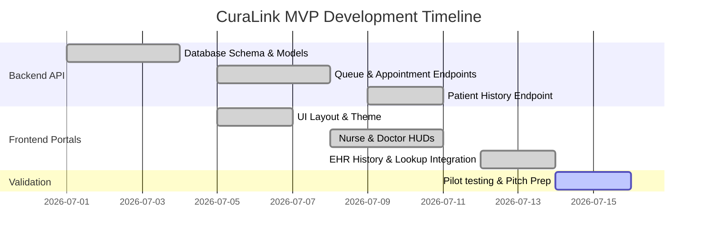

# MVP Planning & Roadmap: CuraLink

This document outlines the Minimum Viable Product (MVP) scope, milestones, and release strategy for CuraLink.

---

## 1. MVP Scope Definition

The goal of the CuraLink MVP is to demonstrate a fully functional, real-time clinical workspace that covers the entire patient journey (Reception -> Nurse Triage -> Doctor Consultation) on a single database.

### Included in MVP (Core Features)
*   **Real-time Queue State**: Syncing status changes (`scheduled`, `checked_in`, `in_consultation`, `completed`) across three portal interfaces.
*   **Vitals logging & Priority Evaluation**: Simple formulaic AI triage sorting.
*   **Clinical Vitals + EHR HUD**: View of active vitals, allergies, chronic illnesses, and historical consultations.
*   **Registrar Dashboard**: Patient lookup by MRN/Email and walk-in check-in forms.
*   **Local DB Seeding**: Seeded SQLite database with realistic mock data for pitch demonstrations.

### Excluded from MVP (Post-MVP Backlog)
*   **Real-time WebSockets**: Replacing the 8-second polling with WebSocket connections for sub-second updates.
*   **Full EHR Integration**: Syncing with legacy EHR platforms (HL7, FHIR standard).
*   **Multi-tenant Clinics**: Supporting multiple physical clinics with distinct databases.
*   **SMS Patient Alerts**: Pushing wait-time updates to patients' mobile phones.

---

## 2. Release Roadmap

---

## 3. Product Launch & Pilot Metrics
When launching the MVP, we will measure:
1.  **System Reliability**: Ensure 100% uptime of the FastAPI polling worker during simulated clinical shifts.
2.  **Telemetry Sync Latency**: Average time taken for doctor HUD to render vitals recorded by the nurse (Target: < 8 seconds).
3.  **Lookup Success Rate**: Percentage of historic appointments correctly retrieved by Receptionist lookup queries.
